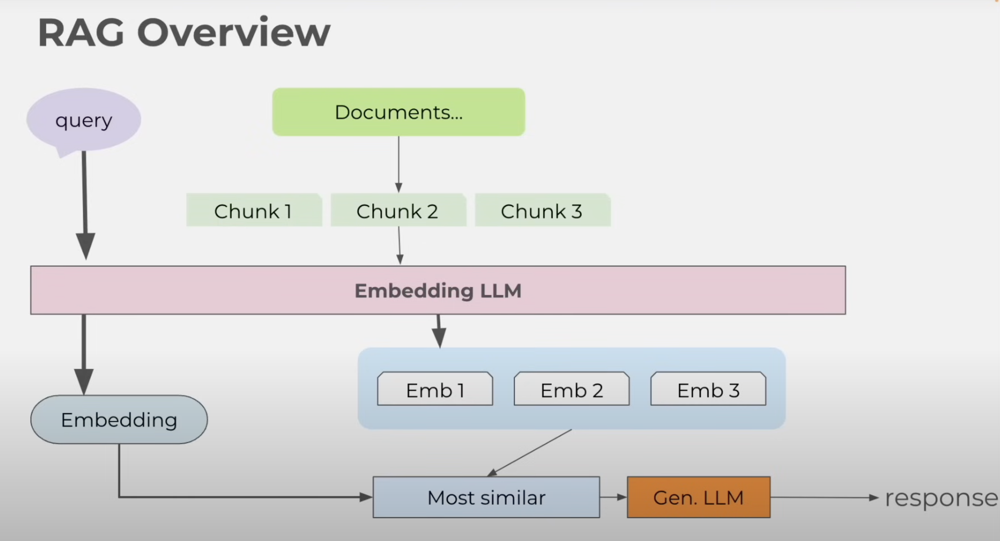
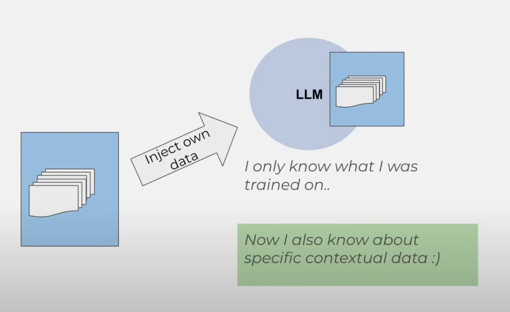
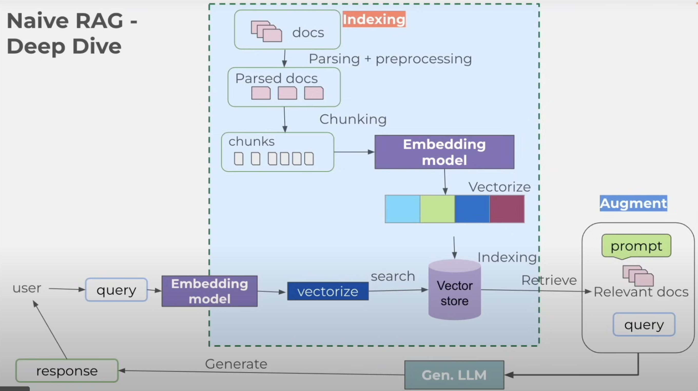
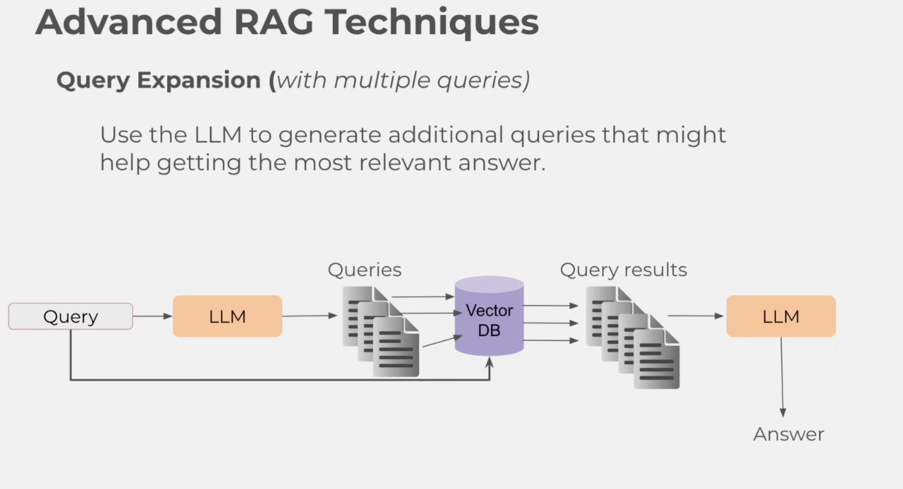
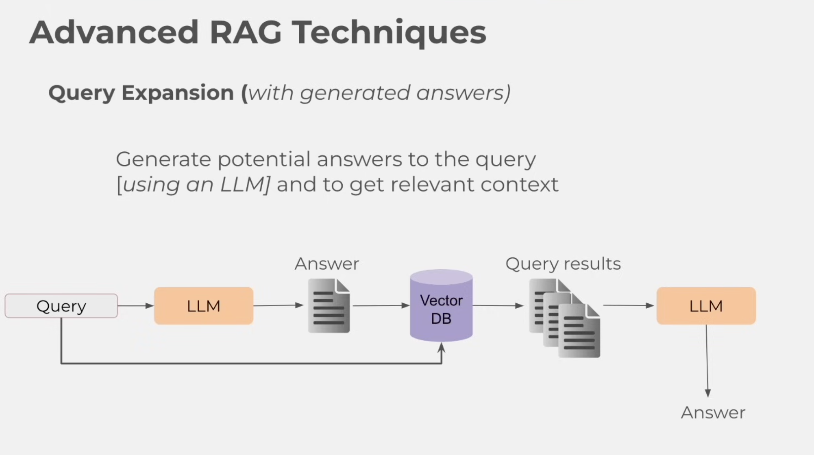
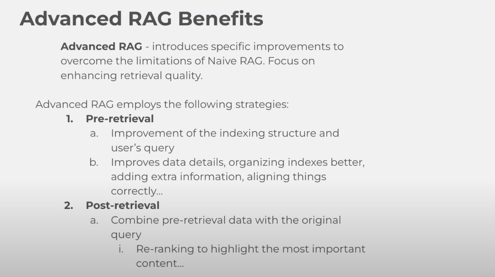

# 4. RAG – Grounding Agents in External Knowledge

## What is RAG?

**RAG (Retrieval-Augmented Generation)** is a framework that combines the strengths of **retrieval-based systems** and **generation-based models** to produce more accurate and contextually relevant responses.

In simpler terms, RAG is an **efficient way to customize an LLM with your own data**  without retraining the model.

Instead of relying solely on the LLM’s fixed internal knowledge (which may be outdated or generic), RAG allows the system to **fetch relevant information from your private documents** (e.g., resumes, technical specs, job descriptions) and use it to generate grounded, personalized answers.

---

## RAG Architecture Overview

The diagram above illustrates the core pipeline of a Retrieval-Augmented Generation system. Here’s how each component works:

---

### 1. **Query**
- The user or agent submits a question (e.g., “What did I say about LangChain in my resume?”)
- This query is sent to the **Embedding LLM** for vectorization.

---

### 2. **Documents → Chunks**
- Source documents (PDFs, text files, etc.) are preprocessed into smaller pieces called **chunks**.
- Each chunk is a manageable unit (e.g., 512 tokens) for embedding and retrieval.
- In our project:  
  → User’s resume → split into chunks like “Projects”, “Skills”, “Experience”.

---

### 3. **Embedding LLM**
- A dedicated model (often lightweight, e.g., `all-MiniLM-L6-v2`) converts both:
  - The **query** → into a vector (`Embedding`)
  - Each **chunk** → into its own vector (`Emb 1`, `Emb 2`, `Emb 3`)
- These vectors live in a **vector database** (like ChromaDB).

> Note: The same model embeds queries and chunks — so they live in the same vector space.

---

### 4. **Most Similar**
- The system compares the **query embedding** with all **chunk embeddings** using similarity metrics (cosine similarity).
- It selects the **most similar chunk(s)** — typically top-3 — as context for the next step.

>  In agentic systems, this is where **re-ranking** or **hybrid search** can improve results.

---

### 5. **Gen. LLM (Generation LLM)**
- The selected chunk(s) + original query are fed into a **generation LLM** (e.g., Llama 3, GPT-4, or local Ollama model).
- The LLM generates a response **grounded in the retrieved context** — not just its internal knowledge.

>  Example:  
> Query: “How would you design a sponsor tracker?”  
> Retrieved Chunk: “Used LangChain agents with PostgreSQL memory”  
> → LLM responds: “You could extend your existing agent system…”

---

### 6. **Response**
- The final output — a factually grounded, personalized answer — is returned to the user or agent.

---

## Why This Matters for Agentic AI
This architecture allows agents to:
- **Act on private data** without fine-tuning
- **Avoid hallucinations** by grounding answers in real documents
- **Scale** beyond the LLM’s context window
- **Adapt dynamically** — new documents? Just re-index.

In your **Agentic Interview Council**, this means:
- The Interviewer doesn’t guess — it **reads your resume** via RAG
- Evaluators don’t assume — they **check what you actually wrote**

This is how agents become **truly contextual, not just conversational**.

**RAG turns a generic LLM into a contextual agent.**

---

## Naive RAG: Deep Dive

The diagram above shows the complete workflow of a **Naive RAG system**, which follows a simple, linear pipeline without advanced optimizations. Let’s break it down:

---

### 🔹 Phase 1: Indexing (Offline)

This happens **once**, when you first ingest your documents.

#### 1. **Docs → Parsed Docs**
- Raw documents (PDFs, TXT, etc.) are parsed into plain text.
- This step may include cleaning (removing headers, footers, metadata).

#### 2. **Parsed Docs → Chunks**
- Text is split into fixed-size chunks (e.g., 512 tokens).
- No semantic awareness — chunks may break sentences or separate related concepts.

#### 3. **Chunks → Embedding Model → Vectorize**
- Each chunk is passed through an **embedding model** (e.g., `all-MiniLM-L6-v2`) to convert it into a vector.
- These vectors are stored in a **vector store** (like ChromaDB or FAISS) during **indexing**.

>  Note: The same model is used later to embed queries — so they live in the same vector space.

---

### 🔹 Phase 2: Augment & Generate (Online — Per Query)

This runs every time a user asks a question.

#### 4. **User Query → Embedding Model → Vectorize**
- The query is embedded using the same model as the chunks.
- Result: a single vector representing the user’s intent.

#### 5. **Vector → Search → Vector Store → Retrieve**
- The query vector is compared against all stored chunk vectors.
- The system retrieves the **top-k most similar chunks** (e.g., top-3) → called “Relevant docs”.

#### 6. **Augment: Prompt + Relevant Docs + Query**
- The LLM prompt is constructed by combining:
  - The original query
  - The retrieved relevant documents (context)
  - A system instruction: “Answer ONLY using the context below.”

#### 7. **Generate: Gen. LLM → Response**
- The Generation LLM (e.g., Llama 3, GPT-4, or local Ollama model) reads the augmented prompt.
- It generates a response **based on the retrieved context** — not its own knowledge.

#### 8. **Response → User**
- The final answer is returned to the user or agent.

---
## Naive RAG Drawbacks / Challenges / Pitfalls

While Naive RAG is simple to implement, it suffers from several critical limitations that make it unsuitable for production-grade or agentic systems. Here’s a breakdown of each challenge:

---

### 1. Limited Contextual Understanding

- The retrieval system treats text as **static vectors**, ignoring semantic relationships or intent.
- Example: A query like *“How do I handle duplicate emails?”* might retrieve a chunk about “email design” instead of “idempotency” — even if the latter is more relevant.
- In agentic AI, this leads to **misaligned actions** — e.g., an agent suggesting UI changes when the real issue is backend logic.

---

### 2. Inconsistent Relevance and Quality of Retrieved Documents

- Vector similarity ≠ factual relevance.
- A chunk may be “similar” in vector space but **factually useless** or **outdated**.
- Example: Retrieving a 2020 article on “LangChain v0.1” when the user asked about current best practices.

---

### 3. Poor Integration Between Retrieval and Generation

- In Naive RAG, retrieval and generation are **loosely coupled**:
  - The LLM gets a list of chunks → it must decide what’s important.
  - No feedback loop: if the answer is wrong, the system doesn’t learn.
- This often results in **incoherent answers** or **ignoring key context**.

---

### 4. Inefficient Handling of Large-Scale Data

- Naive RAG stores all chunks in a single vector DB — no optimization for scale.
- As data grows, retrieval becomes slower and more expensive.
- For agentic systems that need to process hundreds of documents (e.g., company wikis, past projects), this becomes a bottleneck.

---

### 5. Lack of Robustness and Adaptability

- Naive RAG is **static**: once indexed, it doesn’t adapt to new queries, user feedback, or changing data.
- If the user asks a follow-up question, the system doesn’t remember what was retrieved before.
- In agentic AI, this breaks continuity — agents should learn from interactions.

---

## Why This Matters for Our Project

In our **Agentic Interview Council**, if we used Naive RAG:
- The Interviewer might retrieve a chunk about “Python” when you asked about “WebSockets”
- Evaluators might miss key details because the chunk was poorly split
- Coach might give wrong advice based on incomplete context

That’s why we’ll move to **Advanced RAG** next  to fix these issues and build a truly reliable agent.

---

## Advanced RAG Techniques: Solving Naive RAG Pitfalls

Advanced RAG introduces **specific improvements** to overcome the limitations of Naive RAG  focusing on **enhancing retrieval quality** at every stage: before, during, and after retrieval.

Here are key techniques that transform a basic RAG system into a **robust, agentic-ready pipeline**.

---

### 🧩 1. Query Expansion (with Multiple Queries)

#### What It Does:
Instead of sending the user’s original query directly to the vector DB, an LLM generates **multiple reformulated queries** that capture different angles or synonyms.

Example:
> User query: “How to handle duplicate emails?”  
> → LLM generates:  
> - “What is idempotency in email systems?”  
> - “How to prevent duplicate API calls?”  
> - “Best practices for message deduplication”

These queries are sent to the vector DB → retrieve more relevant chunks → improve final answer.

#### Why It Matters:
- Solves **Limited Contextual Understanding** (Naive RAG Pitfall #1)
- Captures semantic variations → finds documents the original query missed

#### In Our Project:
- The **Interviewer Agent** uses this to ask better questions:  
  → If you mention “LangChain”, it might generate:  
  “What are LangChain agents used for?” + “How to implement memory in LangChain?”

---

### 🧩 2. Query Expansion (with Generated Answers)

#### What It Does:
The LLM first **generates a potential answer** to the query  then uses that answer as a “query” to search the vector DB.

This leverages the LLM’s knowledge to **find supporting evidence** for its own answer.

Example:
> User query: “Explain attention in Transformers”  
> → LLM generates draft answer: “Attention allows the model to focus on relevant parts of input…”  
> → This draft is embedded → searched in vector DB → retrieves papers/texts that support or contradict it  
> → Final answer is grounded in retrieved context

#### Why It Matters:
- Solves **Inconsistent Relevance** (Naive RAG Pitfall #2)  
- Ensures the answer is backed by real data  not just hallucination

#### In Our Project:
- The **Evaluator Agents** use this to validate their critiques:  
  → “You said ‘no retry mechanism’ — let me check if any docs mention retries in similar systems.”

---

### 🧩 3. Pre-Retrieval & Post-Retrieval Strategies

Advanced RAG improves performance through two phases:

#### 🔹 Pre-Retrieval Improvements
Before querying the vector DB:
- **Better indexing**: Use semantic chunking (e.g., by sentence/paragraph, not fixed tokens)
- **Metadata enrichment**: Tag chunks with source, date, topic → filter later
- **Query rewriting**: Expand or rephrase the user’s query for better matches

#### 🔹 Post-Retrieval Improvements
After retrieving chunks:
- **Re-ranking**: Use a cross-encoder model to score chunks by relevance (not just similarity)
- **Hybrid search**: Combine vector + keyword (BM25) results
- **Context compression**: Remove redundant or low-value text from retrieved chunks

#### Why It Matters:
- Solves **Poor Integration** (Pitfall #3) and **Lack of Robustness** (Pitfall #5)
- Makes the system **adaptive and scalable**

#### In Our Project:
- We use **semantic chunking** for resumes → preserves meaning
- We **re-rank** retrieved chunks → ensures Coach gets the most useful feedback
- We **filter by metadata** (“source = resume.pdf”) → avoids noise

---

## Summary: Advanced RAG = Smarter, Not Just Bigger

| Naive RAG | Advanced RAG |
|----------|--------------|
| ❌ Static, linear pipeline | ✅ Dynamic, multi-stage optimization |
| ❌ Ignores semantics | ✅ Uses LLMs to understand intent |
| ❌ One-shot retrieval | ✅ Iterative, self-improving retrieval |
| ❌ No feedback loop | ✅ Learns from past sessions |

> 💡 In agentic systems, Advanced RAG isn’t optional — it’s how agents become **reliable, contextual, and truly autonomous**.

---

## Why Not Just Send the File Directly to the LLM?

A natural question arises:  
> *“If I want the LLM to use my resume, why not just paste the whole file into the prompt every time?”*

This approach — often called **“prompt stuffing”** — seems simpler than building a RAG pipeline.  
But it **fails dramatically** in real agentic workflows. Here’s why.

---

### ❌ Limitations of Sending Files Directly to the LLM

#### 1. **Context Window Overflow**
- Modern LLMs have **limited context windows** (e.g., 8K–128K tokens).
- A long resume, project report, or documentation easily exceeds this.
- Result: **Critical information is truncated** → the LLM never sees it.

> 📌 Example: Your resume is 15K tokens → only the first 8K are read → your LangChain project at the end is **ignored**.

#### 2. **Massive Token Waste & Cost**
- Every time you ask a question, you resend the **entire document**.
- If your resume is 10K tokens and you ask 10 questions → **100K+ tokens used**.
- With RAG: only **relevant ~500 tokens** are retrieved per query → **95%+ savings**.

#### 3. **Poor Focus & Hallucination Risk**
- The LLM must **scan thousands of irrelevant lines** to find one fact.
- This increases cognitive load → higher chance of **missing key details** or **hallucinating**.
- RAG, by contrast, gives the LLM **only what it needs** — like a surgeon’s scalpel vs. a sledgehammer.

#### 4. **No Scalability**
- What if you have **10 files**? 100? A database?
- You can’t paste them all into one prompt — it’s **technically impossible**.
- RAG scales naturally: **index once, retrieve forever**.

#### 5. **No Dynamic Adaptation**
- If you update your resume, you must **re-paste it manually** in every future query.
- With RAG: **update the vector DB once** → all future queries use the new version automatically.

---

### ✅ RAG: The Agentic AI Solution

RAG solves all these problems by **separating concerns**:

| Task | Naive Approach (Send File) | RAG Approach |
|------|----------------------------|-------------|
| **Storage** | Not stored — resent every time | Indexed once in vector DB |
| **Retrieval** | None — LLM scans everything | Smart, relevant retrieval |
| **Cost** | Very high (full doc × queries) | Very low (only relevant chunks) |
| **Scalability** | Fails beyond 1 short doc | Works with 1,000+ documents |
| **Accuracy** | Low (noise, truncation) | High (focused context) |

> 🔑 **RAG turns static data into dynamic, query-aware knowledge** — which is **essential for autonomous agents**.

---

### Final Verdict

> **Sending a file directly to an LLM is a shortcut that breaks at scale.**  
> **RAG is the architecture of choice for any serious agentic system.**

It’s not just about “adding data” — it’s about **building agents that perceive, reason, and act on real-world context** — reliably and efficiently.