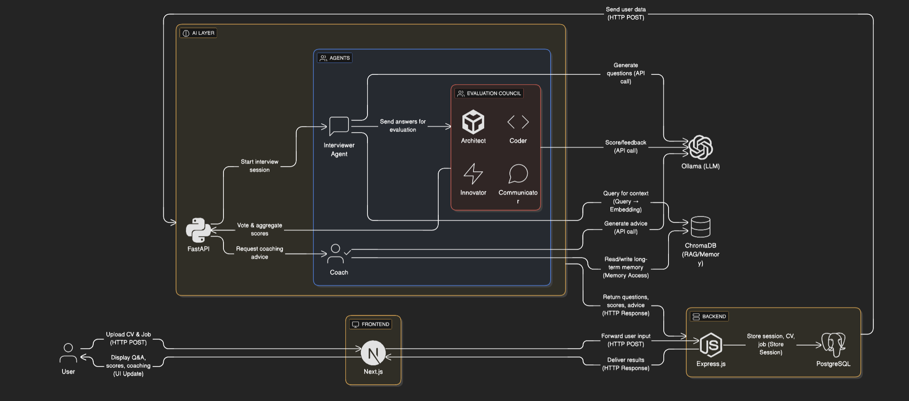
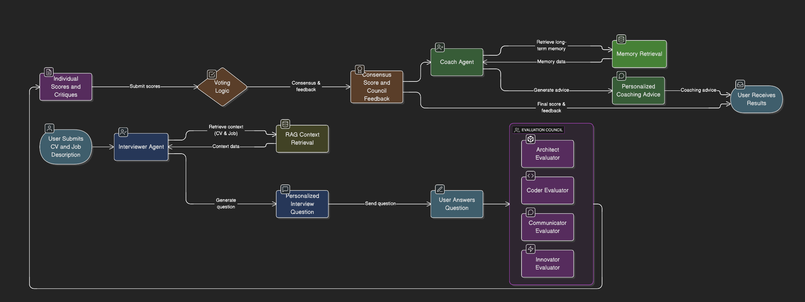

# 🎯 Project: Agentic Interview Council

## What We Built & Why

We built the **Agentic Interview Council**  a multi-agent system that simulates a realistic technical interview experience using **autonomous, collaborative AI agents**.

###  The Problem We Solve
Technical interviews are high-stakes, subjective, and hard to practice. Most AI tools today:
- Ask generic questions to everyone
- Give shallow or hallucinated feedback
- Don’t remember your progress across sessions

Our system fixes this by combining:
- **RAG** to ground questions in your real CV and job target
- **Multi-agent collaboration** to reduce bias and increase depth
- **Memory** to track your growth over time
- **Voting & debate** to ensure feedback quality

This isn’t just “an LLM with a prompt” it’s a **team of autonomous agents working toward a shared goal**: helping you become a better engineer.

>  **Key insight**: Agentic AI isn’t about complexity  it’s about **autonomous, purposeful behavior**. Our system doesn’t just respond  it **initiates, evaluates, and teaches**.

---

##  General Architecture: Full Stack Overview

Our system uses a clean, modular architecture that separates concerns for scalability and maintainability:



###  Key Components

| Layer | Technology | Role |
|-------|----------|------|
| **Frontend** | Next.js | User interface  upload CV/job, display questions, scores, coaching advice |
| **Backend** | Express.js | Orchestrates data flow, stores user state in PostgreSQL, proxies to FastAPI |
| **AI Layer** | FastAPI (Python) | Hosts Interviewer, Evaluation Council, Coach agents uses LangChain, Ollama, ChromaDB |
| **Database** | PostgreSQL | Structured storage: user sessions, CV/job text, skill gaps |
| **Vector DB** | ChromaDB | Unstructured storage: RAG context, embedded chunks for retrieval |
| **LLM** | Ollama (`llama3.2:3b`) | Local, free, reproducible  used by all agents for reasoning and generation |

>  **No cloud APIs needed** — fully offline with Ollama.

---

##  How We Applied Agentic AI: Agent Flow & Tools

Our system embodies the core principles of Agentic AI through four key components:

### 1. **Goal-Driven Autonomy**
- The system runs an entire interview loop without human intervention.
- Example: After receiving your CV + job, the **Interviewer Agent** autonomously generates a personalized question.

### 2. **Tool Use**
Agents use external tools to act in the world:
- **RAG (ChromaDB)**: To retrieve relevant context from your CV/job
- **Memory (PostgreSQL)**: To read/write long-term skill gaps
- **Voting Logic**: To resolve disagreements between evaluators
- **Ollama (LLM)**: To generate questions, critiques, and advice

> Each agent has its own set of tools  not just one monolithic model.

### 3. **Multi-Agent Collaboration**
We use a **council of 4 specialized evaluators**:
- **Architect Evaluator**: Focuses on system design, scalability
- **Coder Evaluator**: Checks code quality, edge cases
- **Communicator Evaluator**: Judges clarity, structure
- **Innovator Evaluator**: Looks for novelty, impact

They **debate and vote** to produce consensus-based feedback — reducing individual bias and increasing reliability.

### 4. **Memory & Adaptation**
The **Coach Agent** reads your long-term memory (from PostgreSQL) to tailor advice:
> “You missed idempotency in 2/3 sessions → add UUIDs to email API calls.”

This ensures the system **learns from past interactions**  not just reacts.

---

##  Agent Workflow 

Here’s how data flows through our agents:




1. **User Input**:  
   - Uploads CV + Job Description → sent to Express → stored in PostgreSQL → forwarded to FastAPI

2. **Interviewer Agent**:  
   - Uses RAG (ChromaDB) to extract topics → generates first question → sends to user

3. **User Answers**:  
   - Types response → sent to Evaluation Council

4. **Evaluation Council**:  
   - Each evaluator scores independently → votes → final score + feedback

5. **Coach Agent**:  
   - Reads long-term memory → synthesizes feedback → generates actionable advice

6. **Output**:  
   - Final score, council feedback, coaching advice → returned to user via Express → displayed in Next.js

---

##  Why This Meets Build IT Requirements

| Criteria | How We Meet It |
|---------|----------------|
| **Documentation (README)** | Clear concept explanation, architecture diagrams, agent roles, trade-offs |
| **Implementation Quality** | Working CLI/API app with RAG, memory, voting — no UI needed |
| **Presentation & Explanation** | Diagram + step-by-step flow + code snippets for key logic |
| **Creativity** | Multi-agent council + debate + coaching — beyond standard chatbots |

---

## 📦 Setup Instructions 

1. Clone repo:  
   ```bash
   git clone https://github.com/boujoudev/build-it-agentic-ai
   cd build-it-agentic-ai
